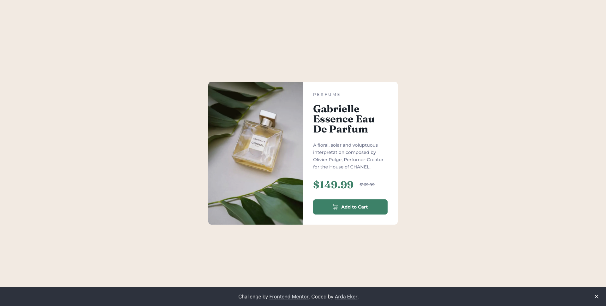

# Frontend Mentor - Product Preview Card Component Solution

This is a solution to the [Product preview card component challenge on Frontend Mentor](https://www.frontendmentor.io/challenges/product-preview-card-component-GO7UmttRfa).

## Table of contents

- [Overview](#overview)
  - [The challenge](#the-challenge)
  - [Screenshot](#screenshot)
  - [Links](#links)
  - [Built with](#built-with)
- [Author](#author)

## Overview

### The challenge

Users should be able to:

- View the optimal layout depending on their device's screen size
- See hover and focus states for interactive elements

## Screenshot

|                  Desktop                   |
| :----------------------------------------: |
|  |

|                  Mobile                   |
| :---------------------------------------: |
|  |

## Links

- Solution URL: [Solution]()
- Live Site URL: [Live Site]()

## Built with

- Semantic HTML5 markup
- Mobile-first workflow
- [Next.js](https://nextjs.org/) - React framework
- [Tailwind CSS](https://tailwindcss.com) - For styles
- [Framer Motion](https://www.framer.com/motion/) - For animations

## Author

- Website - [www.ardaeker.com](https://ardaeker.com)
- Frontend Mentor - [@ardaeker](https://www.frontendmentor.io/profile/ardaeker)
